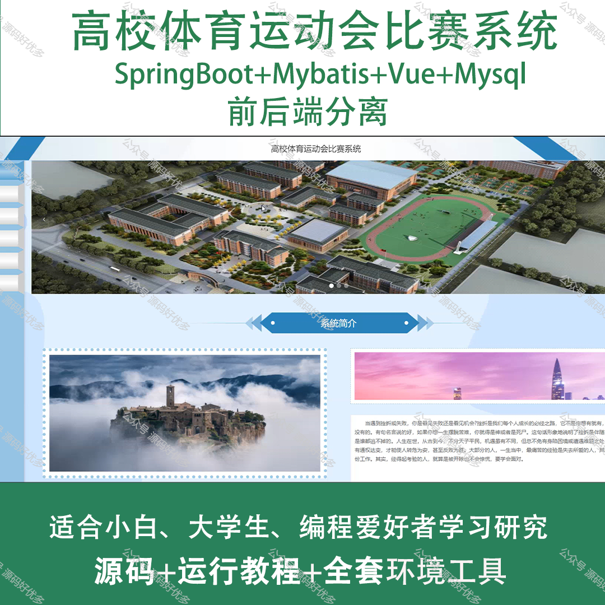
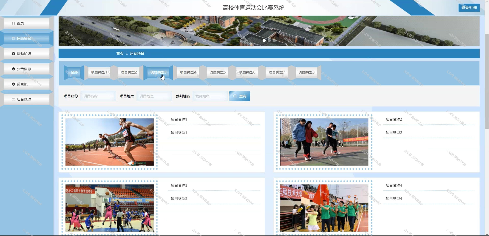
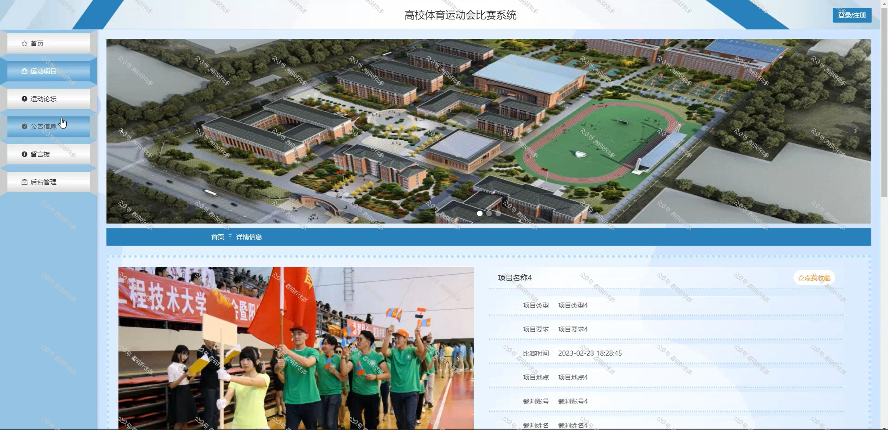
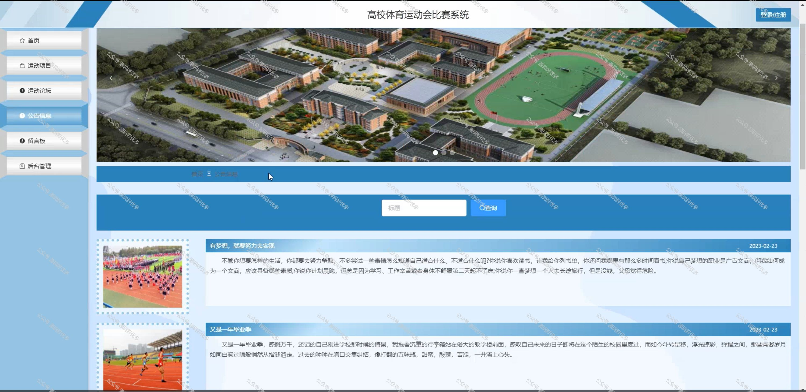
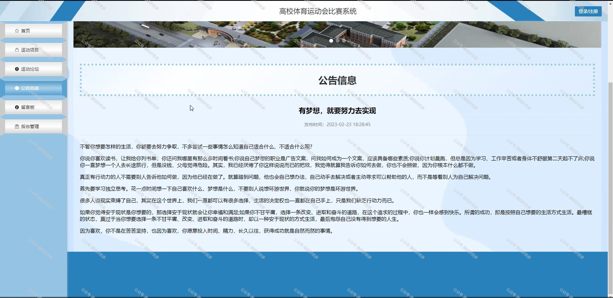
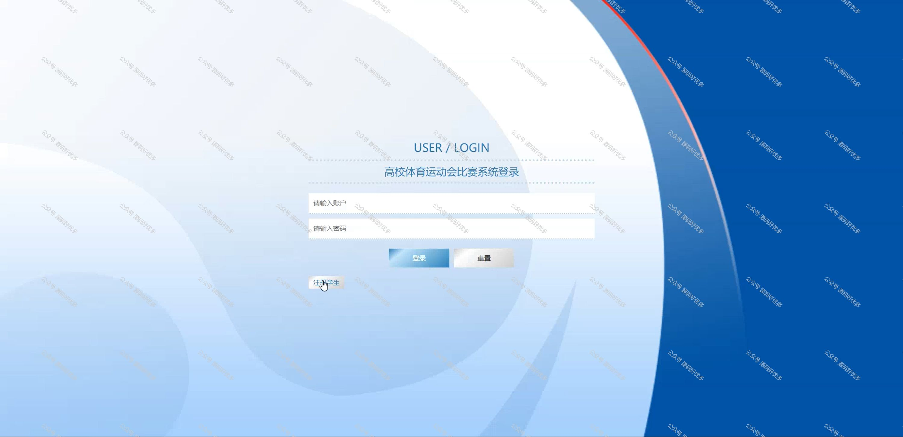
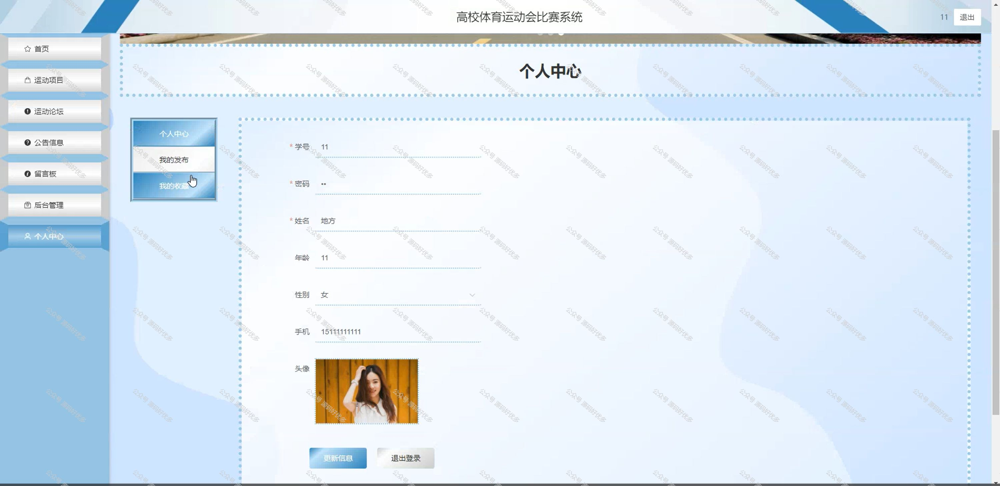
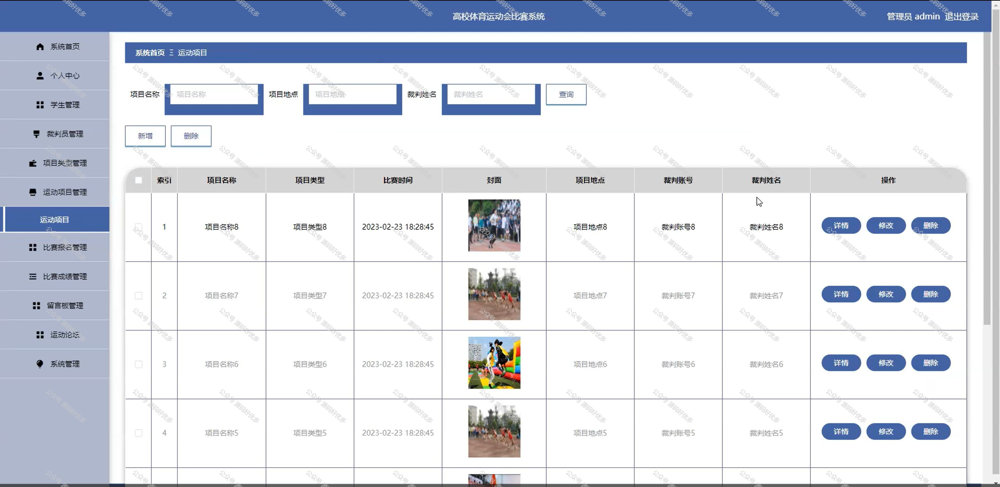
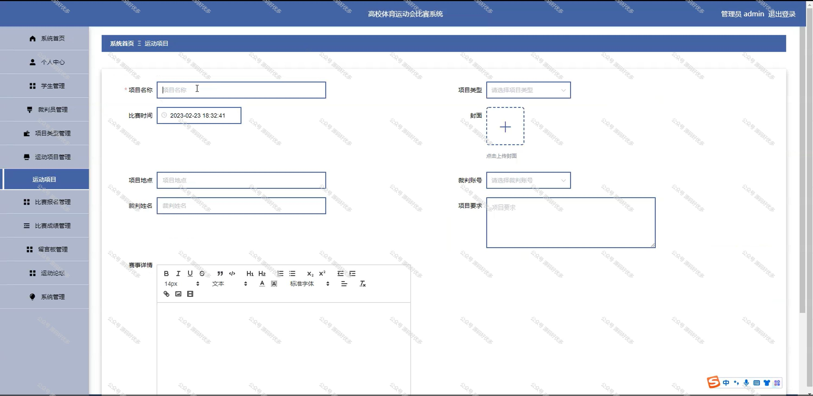

 
## 查看主页获取源码

### 一、作品包含

源码+数据库+全套环境和工具资源+部署教程

### 二、项目技术

前端技术：Html、Css、Js、Vue、Element-ui

数据库：MySQL

后端技术：Java、Spring Boot、MyBatis

  

### 三、运行环境

开发工具：IDEA/eclipse

数据库：MySQL5.7

数据库管理工具：Navicat10以上版本

环境配置软件： JDK1.8+Maven3.6.3

前端Nodejs：14

### 四、项目介绍
项目编号：springbootA161

高校党建基本数据管理系统的背景在于响应新时代党的建设总要求，提升高校党建工作信息化、规范化水平。随着高校党建工作的不断深化，对于党员信息、党组织活动、党风廉政建设等数据的收集、处理和分析提出了更高要求。传统的手工管理方式已无法满足高效、精准的管理需求，因此，开发一套集数据采集、存储、分析于一体的党建数据管理系统，对于加强高校党的建设，提高党建工作的科学性和实效性具有重要意义。

系统分为管理员、学生、教工
管理员的功能：系统首页、个人中心、学生管理、教工管理、党组织信息管理、学生入党管理、教职工入党管理和系统管理。
学生的功能：系统首页、个人中心、党组织信息管理、学生入党管理、系统管理。
教工的功能：系统首页、个人中心、党组织信息管理、教工入党管理、系统管理。

### 五、运行截图

  

