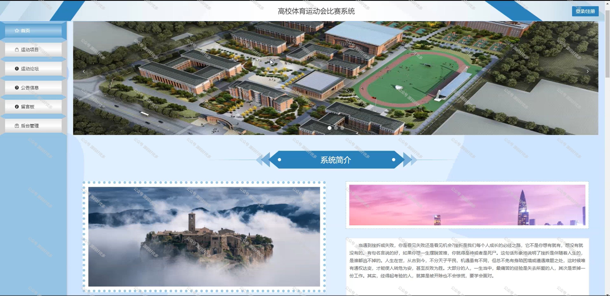
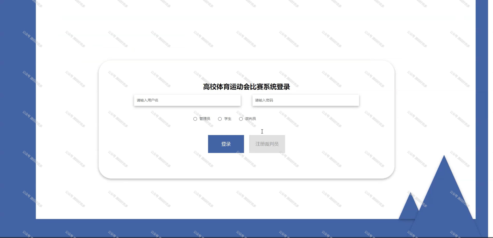

 
## 查看主页获取源码

### 一、作品包含

源码+数据库+全套环境和工具资源+部署教程

### 二、项目技术

前端技术：Html、Css、Js、Vue、Element-ui

数据库：MySQL

后端技术：Java、Spring Boot、MyBatis

  

### 三、运行环境

开发工具：IDEA/eclipse

数据库：MySQL5.7

数据库管理工具：Navicat10以上版本

环境配置软件： JDK1.8+Maven3.6.3

前端Nodejs：14

### 四、项目介绍
项目编号：springbootA171

高校体育运动会比赛系统是为了更好地组织和管理高校体育运动会，提高赛事的组织效率，确保比赛公平公正而开发的。系统以高校体育运动会为背景，紧密结合赛事组织和管理的需求，旨在为学校提供一个便捷、高效、智能的运动会比赛管理平台。通过该系统，为参赛者和观众提供良好的赛事体验。此外，高校体育运动会比赛系统还具备良好的用户体验和可扩展性，为学校举办大型体育赛事提供有力支持。

前台学生功能：浏览首页、运动项目、运动论坛、公告信息、留言板、后台管理和个人中心。

后台分为管理员、学生、裁判员
管理员的功能：系统首页、个人中心、学生管理、裁判员管理、项目类型管理、运动项目管理、比赛报名管理、比赛成绩管理、留言板管理、运动论坛、系统管理。
学生的功能：系统首页、个人中心、比赛报名管理、比赛成绩管理。
裁判员的功能：系统首页、个人中心、运动项目管理、比赛报名管理、比赛成绩管理。

### 五、运行截图

  
